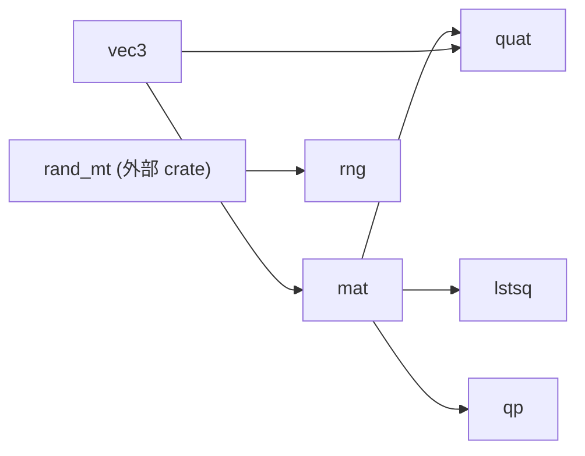
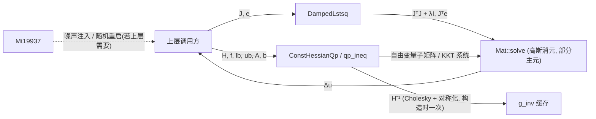

# control-math

control 仿神经五层架构中的**基础算术层**:整个 crate 集合的叶子依赖,被几乎所有其他 crate 使用。

## 核心设计意图

- **零魔法、全显式**:所有算术逐表达式写出,不依赖泛型、宏或外部线性代数库。任何一处数值行为都可以在源码中直接读到,这对控制环路的可复现性与可审计性至关重要。
- **确定性**:随机数使用固定种子的 MT19937(`rng`),`Vec3::perp` 等几何辅助均走确定性分支,同一次运行在任意平台上复现同一结果。
- **叶子职责**:本 crate 只做算术——三维向量、四元数、稠密行主序矩阵、确定性随机流、常 Hessian QP 求解器与阻尼最小二乘。它不知道"控制器""机器人""信号"为何物,因此可以稳定地处于依赖图最底层。
- **不改契约**:所有类型与方法构成下游 crate 的公共契约,接口保持稳定;模块间的引用严格单向(见下),不存在环。

## 模块一览

| 模块 | 内容 | 内部依赖 |
| --- | --- | --- |
| `vec3` | `Vec3`:三维向量(加减、点叉积、归一化、确定性垂向量) | 无 |
| `mat` | `Mat`:稠密行主序矩阵(构造、块操作、乘积、高斯消元 `solve`/`inv`、轴角与旋转向量) | `vec3` |
| `quat` | `Quat`:单位四元数与旋转矩阵/旋转向量互换 | `mat`、`vec3` |
| `rng` | `Mt19937`:确定性随机流(`next_f64` 均匀分布、`randn` Box-Muller 标准正态) | 无(仅 `rand_mt`) |
| `lstsq` | `DampedLstsq`:雅可比上的阻尼最小二乘(左逆/右逆两种形式) | `mat` |
| `qp` | `box_qp` / `qp_ineq` / `qp_ineq_warm` 自由函数,`ConstHessianQp` 常 Hessian 热启动求解器 | `mat` |

## 模块依赖拓扑



依赖严格单向:`vec3` 在最底,`mat` 居中,`quat` / `lstsq` / `qp` 在上,`rng` 独立。图为 DAG,无环。

## 信号流

以一次典型调用链为例(如上层控制器求一步 QP):



要点:`ConstHessianQp` 在构造时对 Hessian 做一次 Cholesky 分解并缓存其逆(`g_inv`),之后每次求解只做矩阵-向量乘与活跃集调整,这就是"常 Hessian"名称的由来。

## 对外依赖与理由

| 依赖 | 用途 | 理由 |
| --- | --- | --- |
| `rand_mt = 6.0.3`(默认特性关闭) | `rng` 模块的 MT19937 引擎 | 纯算法实现,无传递依赖,与本 crate 的确定性目标一致;除此之外不引入任何运行时依赖。 |

本 crate 不携带任何 dev-dependency,`src/` 链接的全部内容就是上述算术。

## 构建与测试

```sh
make test   # 等价于 mbx test
mbx clippy --all-targets -- -D warnings
```

`Cargo.toml` 中仅保留一条 lint 豁免:`clippy::needless_range_loop = "allow"`。矩阵内核按声明的 `rows`/`cols` 索引并行数组而非按切片长度,索引本身即数学结构,故保留。
